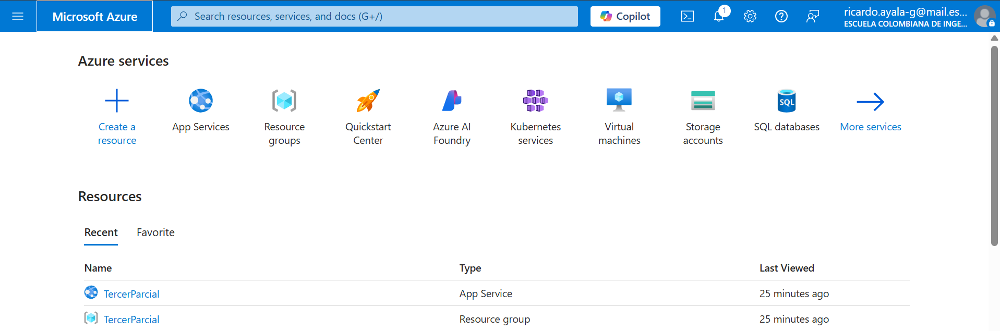

# Tercer_Parcial_Back

### Estudiante:
- **Nombre:** *[Ricardo Ayala Garzon]*
- **Grupo:** *CVDS - Tercer Tercio*

---

## Descripción

Este backend implementa el sistema de gestión de citas médicas para la clínica **ECI Salud Vital**. Permite:
- Visualizar especialidades médicas.
- Programar citas con validación.
- Consultar historial de citas por correo.
- Cancelar citas.
- Guardar todo en MongoDB y exponer API REST desplegada en Azure.

---

## Tecnologías

- Java 17
- Spring Boot 3.2.0
- MongoDB
- Swagger
- Azure App Service
- JUnit + Mockito

---

## Arquitectura

### estructura del parcial


## Despliege en Azure



```plaintext
[React Frontend] ---> [REST API - Spring Boot] ---> [MongoDB Atlas]
```

## Ejecutar el Proyecto

Se implementaron pruebas unitarias usando JUnit y Mockito para asegurar el correcto funcionamiento del codigo

```
./mvnw test
```

## Endpoints REST principales
Método	Endpoint	Descripción
GET	/especialidades	Lista todas las especialidades
POST	/citas	Crea una nueva cita médica
GET	/citas/{correo}	Citas asociadas a un paciente
GET	/citas/{correo}/estado/{estado}	Historial filtrado por estado
PUT	/citas/{id}/cancelar	Cancela una cita específica
